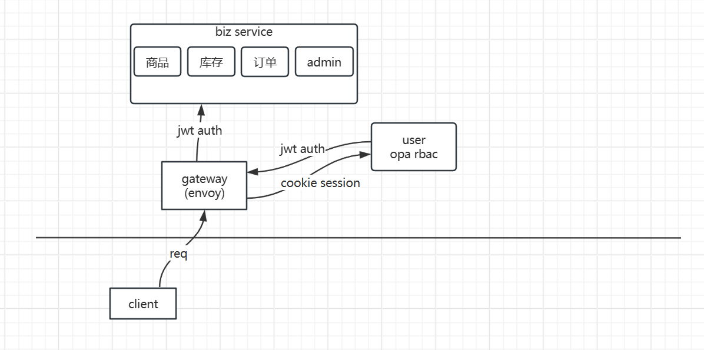

# xshop
 一个练手的电商服务、IM服务。
* 基于kratos，etcd服务注册与发现，openapi, otel链路追踪，入参validata, gorm；
* envoy网关, idgen, 定时任务；
* 基于Open Policy Agent的rbac权限体系；
* es搜索；
* DDD

整体架构如下



## quick start

### Docker
```bash
# build
docker build -t <your-docker-image-name> .

# run
docker run --rm -p 8000:8000 -p 9000:9000 -v </path/to/your/configs>:/data/conf <your-docker-image-name>
```

